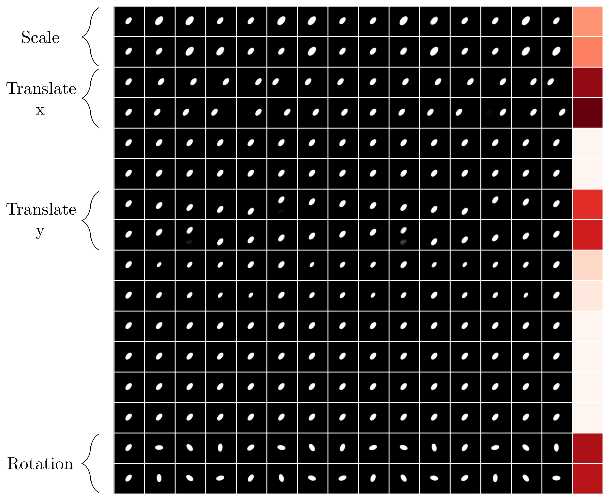

# Linear Disentangled Representations and Unsupervised Action Estimation

This repository houses the official PyTorch implementation of our NeurIPS 2020 paper "Linear Disentangled Representations and Unsupervised Action Estimation".

## Abstract
*Disentangled representation learning has seen a surge in interest over recent times, generally focusing on new models to optimise one of many disparate disentanglement metrics. It was only with Symmetry Based Disentangled Representation Learning that a robust mathematical framework was introduced to define precisely what is meant by a ``linear disentangled representation". This framework determines that such representations would depend on a particular decomposition of the symmetry group acting on the data, showing that actions would manifest through irreducible group representations acting on independent representational subspaces. ForwardVAE subsequently proposed the first model to induce and demonstrate a linear disentangled representation in a VAE model. In this work we empirically show that linear disentangled representations are not present in standard VAE models and that they instead require altering the loss landscape to induce them. We proceed to show that such representations are a desirable property with regard to classical disentanglement metrics. Finally we propose a method to induce irreducible representations which forgoes the need for labelled action sequences, as was required by prior work. We explore a number of properties of this method, including the ability to learn from action sequences without knowledge of intermediate states and robustness under visual noise. We then demonstrate that it can successfully learn 4 different symmetries directly from pixels.*




## Code Structure 
The source has the following structure:
- datasets: Stores PyTorch datasets and code to initialise them
- logger: Stores tensorboard logging and image generation code
- metrics: Stores all disentanglement metrics 
- models: Stores all models used
- main.py: Defines the command line args to run training and executes the trainer
- trainer.py: Sets up parameters for training, optimisers etc.
- training_loop.py: Defines the model independent training logic

[The FlatLand dataset can be found here.](https://github.com/Caselles/NeurIPS19-SBDRL)

## Example

All experiments are run via the [`main.py`](./main.py) and using the hyperparameters from the supplementary material. 

For example, 
```bash
python main.py --model=rgrvae --epochs=200 --gvae-gamma=10 --group-structure c+ c- --dataset=flatland
```
will run RGrVAE for 200 epochs on the flatland dataset. By default all metrics will be logged to tensorboard under logs/version_{NUM}, where NUM increments every run. 

## Extending

### Datasets
New datasets can be added by simply adding entries to the `transforms`, `datasets` and `dataset_meta` dicts in [`datasets.py`](./datasets/datasets.py). They can then be referenced in the `--dataset` argument in [`main.py`](./main.py). 
Datasets can return an image and label tuple if normal autoencoding is desired. For use with Forward and RGrVAE, datasets must return ((img1, action label), img2).

For compatability with disentanglement metrics, any new datasets should implement the following:
- `def generative_factors(self, index):` Returns the generative factors (torch.Tensor) of data at index
- `def latent_to_index(self, latents):` Returns the index (int) of an image with the given latents
- `def index_to_latent(self, index):` Returns the latent/generative factors at given index
- `def get_img_by_latent(self, latent):` Returns an image with the given latents
- `def sample_latent(self):` Samples generative factors randomly, returning a Tensor for 1 instance

### Models
New models can be added by adding entries to the `models` dict in [`models.py`](./models/models.py) and can then be referenced in the `--model` argument in [`main.py`](./main.py). 

## Citation
If you use this code in your work, we ask that you cite our paper:

```
@article{painter2020linear,
  title={Linear Disentangled Representations and Unsupervised Action Estimation},
  author={Painter, Matthew and Hare, Jonathon and Prugel-Bennett, Adam},
  journal={arXiv preprint arXiv:2008.07922},
  year={2020}
}
```